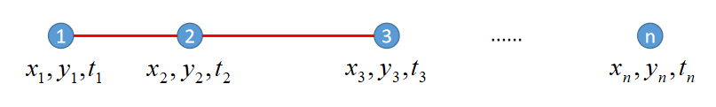
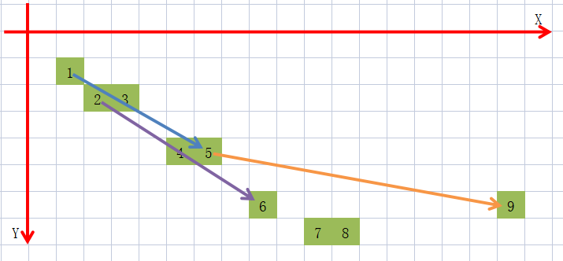

# 算法原理

## 速度的计算

我们知道，要想计算速度，必须要有距离s和时间t.

点1到点2之间的平均速度，既可以当做点1位置的瞬时速度，也可以当做点2位置的瞬时速度。

这里，不失一般性，我们把计算出来的值都归到其开头的位置，这样可以简化问题。

假设鼠标轨迹点有n个，那么速度序列就应该有n-1个，加速度序列就有n-2个，依次类推。

## 速度为0，可能仍在运动！
还是以上图为例，假设正在使用selenium的moveto操控浏览器。

先从点1调到点2，然后原地sleep 12小时，再调到点3，那么计算点2的速度就接近于0，这就出现了漏检鼠标跳变的问题。

为了解决这个问题，我们对两点之间的时间差做了阶段

```python
self._arr_diff_time = np.clip(self._arr_diff_dis[:, -1:], 0, self.max_duration_silent)
```

这样，即使存在睡眠的情况，也会计算出一个高速的移动。


## 方向角的计算

我们在计算方向角的时候，尽量避免使用连续的两个点，因为那样很容易出现大量45度，90度的现象，
不利于我们分析问题。

我们采用的方法为计算一定间隔的两点之间的角度，当做其起点位置的方向角，对应代码如下：
```python
arr_diff_dis = self.arr_trace[self.max_doa_point:, :-1] - self.arr_trace[:-self.max_doa_point, :-1]
```

当方向角正切值等于无穷的时候，还需做截断：
```python
np.clip(arr_diff_dis[:, 1] / arr_diff_dis[:, 0], -self.max_doa_tan, self.max_doa_tan)
```

## 轨迹向量化
轨迹向量化的目的是为了计算轨迹间的相似度。
这里我们需要考虑的问题包括：
- 具备一定容错性
- 存储开销不可过大
- 计算相似度的方法高效
- 具备一定可解释性

我们采用的是直方图的方法，采用分桶的机制进行像素级别的容错。
具体代码见 API


## 轨迹向量间的相似度计算
计算向量之间相似度的方法采用的是计算分布之间的绝对值距离，
该算法比起JS散度，计算更高效且可解释性强。
具体代码见 API