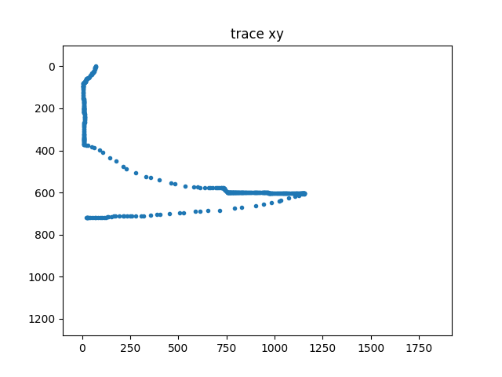
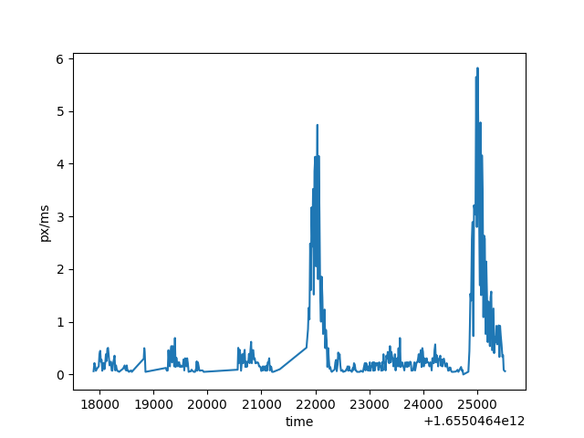
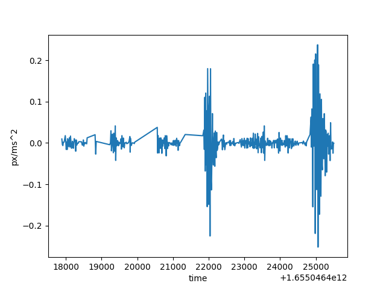
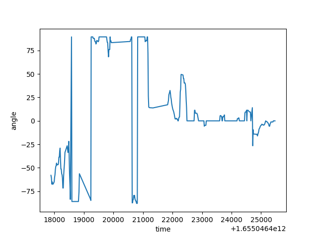

# 特征工程

## 业务分析
经过调研，我们可以将带有以下特征的鼠标轨迹判定为机器轨迹：
- 跳变运动（鼠标由一个点直接跳到很远的另一个点）【实现】
- 横/竖直线运动（人手可能会画出横/竖直线，但是很难画出非常长的横/竖直线）【实现】
- 斜直线运动（人手可能会画出横/竖直线，但是画不出来斜直线）【实现】
- 分速度的匀速运动【实现】
- 分速度的匀变速运动【实现】
- 分速度的匀变加速运动【实现】
- 合速度的匀速运动【实现】
- 合速度的匀变速运动【实现】
- 合速度的匀变加速运动【实现】
- 轨迹点间 时间间隔非常大的运动（比如pyautogui、鼠标录制软件【普通速度】）【实现】
- 轨迹点间 时间间隔远偏离均值的运动（鼠标录制软件【适当加速】）同上
- 轨迹点间 时间间隔非常小，但是运动速度和加速度非常大的运动（鼠标录制软件【高速】）可以视为跳变
- 路径重复的运动（防止一些未知的鼠标录制软件可以躲过以上防御，这里可以加最后一层防御）【实现】

爬虫和反爬虫是一个对抗的过程，如果大家还有其他的想法，欢迎补充

## 特征提取
经过调研和业务分析，我们抽取了以下特征：
- 鼠标移动速度
- 鼠标移动加速度（二阶速度）
- 鼠标移动n阶速度
- 鼠标移动分速度
- 鼠标移动分加速度（二阶速度）
- 鼠标移动分n阶速度
- 鼠标移动方向角的变化
- 鼠标轨迹点之间的时间间隔
- 鼠标轨迹的向量化（可用来计算轨迹间的相似度）

通过这些特征的提取，基本可以覆盖到我们的业务需求

## 可视化
### 鼠标轨迹展示
```python
trace_answer_unlock = [[72, 0, 1655046417887], [72, 1, 1655046417903], [70, 3, 1655046417916], [69, 5, 1655046417930], [68, 6, 1655046417951], [67, 8, 1655046417983], [67, 10, 1655046417996], [65, 15, 1655046418010], [62, 20, 1655046418023], [61, 23, 1655046418036], [59, 26, 1655046418049], [59, 27, 1655046418063], [57, 29, 1655046418076], [55, 31, 1655046418089], [54, 32, 1655046418103], [52, 34, 1655046418116], [49, 38, 1655046418129], [46, 40, 1655046418143], [42, 45, 1655046418156], [37, 50, 1655046418170], [34, 53, 1655046418183], [33, 55, 1655046418196], [30, 56, 1655046418210], [27, 57, 1655046418223], [27, 58, 1655046418236], [26, 58, 1655046418250], [24, 60, 1655046418263], [22, 63, 1655046418276], [19, 67, 1655046418290], [19, 68, 1655046418303], [18, 70, 1655046418316], [17, 71, 1655046418330], [17, 72, 1655046418345], [17, 73, 1655046418361], [17, 74, 1655046418435], [15, 75, 1655046418463], [13, 76, 1655046418476], [12, 77, 1655046418490], [11, 77, 1655046418503], [9, 78, 1655046418516], [9, 79, 1655046418530], [8, 79, 1655046418543], [7, 79, 1655046418583], [7, 80, 1655046418596], [7, 81, 1655046418818], [7, 84, 1655046418828], [7, 88, 1655046418836], [7, 94, 1655046418850], [6, 94, 1655046419230], [6, 95, 1655046419238], [5, 95, 1655046419249], [5, 96, 1655046419263], [5, 97, 1655046419276], [5, 103, 1655046419289], [5, 106, 1655046419303], [5, 108, 1655046419316], [5, 114, 1655046419330], [5, 121, 1655046419343], [5, 124, 1655046419356], [5, 131, 1655046419369], [6, 137, 1655046419383], [6, 139, 1655046419396], [6, 148, 1655046419409], [6, 150, 1655046419423], [7, 154, 1655046419436], [8, 157, 1655046419450], [8, 159, 1655046419463], [8, 162, 1655046419476], [8, 165, 1655046419489], [8, 167, 1655046419503], [9, 169, 1655046419516], [9, 171, 1655046419530], [9, 173, 1655046419543], [9, 175, 1655046419556], [9, 179, 1655046419570], [9, 180, 1655046419583], [9, 184, 1655046419596], [9, 188, 1655046419610], [9, 190, 1655046419623], [9, 194, 1655046419636], [9, 197, 1655046419650], [9, 198, 1655046419671], [9, 199, 1655046419688], [9, 200, 1655046419705], [9, 201, 1655046419716], [9, 202, 1655046419730], [9, 203, 1655046419745], [9, 204, 1655046419769], [9, 205, 1655046419793], [9, 206, 1655046419801], [9, 208, 1655046419809], [9, 209, 1655046419823], [9, 212, 1655046419836], [10, 214, 1655046419850], [10, 215, 1655046419863], [10, 216, 1655046419877], [11, 216, 1655046419890], [11, 217, 1655046419903], [11, 218, 1655046419916], [11, 219, 1655046419930], [11, 220, 1655046420560], [11, 221, 1655046420571], [12, 227, 1655046420583], [12, 230, 1655046420597], [13, 236, 1655046420610], [13, 241, 1655046420623], [13, 242, 1655046420637], [13, 245, 1655046420650], [13, 250, 1655046420663], [13, 253, 1655046420677], [13, 258, 1655046420690], [12, 264, 1655046420703], [12, 266, 1655046420717], [11, 269, 1655046420730], [11, 271, 1655046420744], [10, 274, 1655046420757], [10, 277, 1655046420770], [9, 282, 1655046420783], [9, 285, 1655046420797], [9, 291, 1655046420810], [8, 299, 1655046420823], [8, 302, 1655046420837], [8, 308, 1655046420850], [8, 314, 1655046420863], [8, 318, 1655046420877], [8, 322, 1655046420890], [8, 325, 1655046420904], [8, 328, 1655046420918], [8, 331, 1655046420931], [8, 334, 1655046420944], [8, 337, 1655046420958], [8, 339, 1655046420971], [8, 341, 1655046420984], [8, 343, 1655046420998], [8, 344, 1655046421013], [8, 345, 1655046421025], [8, 347, 1655046421038], [8, 348, 1655046421051], [8, 350, 1655046421064], [8, 352, 1655046421078], [8, 353, 1655046421092], [8, 355, 1655046421104], [8, 356, 1655046421118], [8, 359, 1655046421131], [9, 362, 1655046421145], [9, 366, 1655046421158], [9, 367, 1655046421171], [9, 369, 1655046421184], [9, 371, 1655046421198], [9, 372, 1655046421221], [9, 373, 1655046421342], [11, 373, 1655046421837], [21, 375, 1655046421865], [32, 377, 1655046421878], [49, 382, 1655046421892], [62, 386, 1655046421905], [92, 398, 1655046421918], [109, 410, 1655046421931], [145, 436, 1655046421945], [175, 452, 1655046421959], [214, 476, 1655046421972], [231, 486, 1655046421985], [277, 506, 1655046421998], [332, 524, 1655046422012], [358, 530, 1655046422025], [401, 540, 1655046422039], [461, 554, 1655046422052], [484, 559, 1655046422065], [537, 569, 1655046422078], [579, 574, 1655046422092], [599, 575, 1655046422106], [611, 576, 1655046422118], [637, 576, 1655046422132], [656, 577, 1655046422145], [666, 577, 1655046422158], [679, 578, 1655046422173], [695, 579, 1655046422186], [701, 579, 1655046422198], [712, 579, 1655046422211], [721, 579, 1655046422225], [723, 579, 1655046422239], [729, 579, 1655046422251], [733, 579, 1655046422265], [734, 580, 1655046422278], [736, 580, 1655046422292], [737, 580, 1655046422305], [737, 581, 1655046422358], [738, 582, 1655046422373], [740, 584, 1655046422385], [742, 587, 1655046422398], [743, 587, 1655046422414], [744, 589, 1655046422426], [748, 592, 1655046422438], [751, 595, 1655046422452], [755, 598, 1655046422465], [757, 599, 1655046422478], [757, 600, 1655046422492], [758, 600, 1655046422506], [759, 600, 1655046422518], [760, 600, 1655046422562], [761, 600, 1655046422577], [762, 600, 1655046422587], [763, 600, 1655046422598], [765, 600, 1655046422611], [766, 600, 1655046422625], [768, 600, 1655046422638], [769, 600, 1655046422651], [770, 600, 1655046422664], [771, 600, 1655046422678], [772, 600, 1655046422698], [773, 600, 1655046422706], [774, 600, 1655046422718], [777, 600, 1655046422732], [780, 600, 1655046422748], [781, 600, 1655046422761], [782, 600, 1655046422775], [783, 600, 1655046422825], [784, 600, 1655046422848], [785, 601, 1655046422884], [786, 601, 1655046422918], [789, 601, 1655046422932], [790, 601, 1655046422945], [793, 601, 1655046422959], [795, 601, 1655046422972], [796, 601, 1655046422985], [798, 601, 1655046422998], [799, 601, 1655046423012], [802, 601, 1655046423025], [803, 601, 1655046423039], [805, 601, 1655046423052], [807, 601, 1655046423065], [810, 601, 1655046423078], [811, 601, 1655046423092], [814, 601, 1655046423105], [815, 601, 1655046423118], [818, 601, 1655046423132], [820, 600, 1655046423145], [823, 600, 1655046423159], [826, 600, 1655046423173], [827, 600, 1655046423185], [830, 600, 1655046423198], [832, 600, 1655046423212], [834, 600, 1655046423225], [835, 600, 1655046423239], [838, 600, 1655046423252], [839, 600, 1655046423265], [844, 600, 1655046423278], [847, 600, 1655046423292], [850, 600, 1655046423305], [851, 600, 1655046423318], [856, 600, 1655046423332], [860, 600, 1655046423345], [866, 600, 1655046423359], [869, 600, 1655046423372], [872, 600, 1655046423386], [879, 600, 1655046423399], [882, 600, 1655046423412], [888, 600, 1655046423426], [892, 600, 1655046423438], [896, 600, 1655046423451], [898, 600, 1655046423464], [901, 600, 1655046423478], [906, 600, 1655046423491], [907, 600, 1655046423504], [911, 600, 1655046423518], [915, 600, 1655046423531], [917, 600, 1655046423544], [924, 600, 1655046423558], [926, 600, 1655046423571], [935, 600, 1655046423584], [937, 600, 1655046423598], [940, 600, 1655046423612], [943, 600, 1655046423625], [945, 600, 1655046423638], [947, 600, 1655046423652], [948, 600, 1655046423665], [951, 601, 1655046423679], [953, 601, 1655046423692], [956, 601, 1655046423705], [958, 601, 1655046423719], [961, 601, 1655046423732], [963, 601, 1655046423745], [966, 601, 1655046423759], [969, 602, 1655046423772], [972, 602, 1655046423785], [973, 602, 1655046423799], [974, 602, 1655046423812], [975, 602, 1655046423825], [977, 602, 1655046423839], [980, 602, 1655046423852], [981, 602, 1655046423865], [983, 602, 1655046423879], [986, 602, 1655046423892], [989, 602, 1655046423905], [993, 602, 1655046423919], [998, 602, 1655046423932], [1001, 602, 1655046423945], [1006, 602, 1655046423959], [1012, 602, 1655046423972], [1014, 602, 1655046423986], [1020, 602, 1655046423998], [1026, 602, 1655046424012], [1028, 602, 1655046424025], [1032, 602, 1655046424038], [1036, 602, 1655046424052], [1039, 602, 1655046424066], [1043, 602, 1655046424079], [1046, 602, 1655046424092], [1049, 602, 1655046424105], [1052, 602, 1655046424119], [1054, 602, 1655046424132], [1057, 602, 1655046424145], [1060, 602, 1655046424159], [1061, 602, 1655046424172], [1065, 602, 1655046424185], [1069, 602, 1655046424198], [1072, 602, 1655046424212], [1078, 602, 1655046424225], [1086, 602, 1655046424239], [1089, 602, 1655046424252], [1094, 603, 1655046424266], [1098, 603, 1655046424279], [1100, 603, 1655046424292], [1104, 603, 1655046424306], [1108, 603, 1655046424319], [1113, 603, 1655046424333], [1115, 603, 1655046424345], [1119, 603, 1655046424359], [1121, 603, 1655046424372], [1125, 603, 1655046424386], [1131, 603, 1655046424412], [1133, 603, 1655046424425], [1135, 603, 1655046424438], [1138, 603, 1655046424452], [1140, 603, 1655046424466], [1141, 603, 1655046424480], [1142, 603, 1655046424493], [1144, 603, 1655046424508], [1145, 604, 1655046424519], [1146, 604, 1655046424533], [1147, 604, 1655046424559], [1148, 604, 1655046424607], [1149, 604, 1655046424625], [1150, 604, 1655046424639], [1151, 605, 1655046424655], [1152, 605, 1655046424705], [1154, 605, 1655046424719], [1155, 605, 1655046424733], [1156, 605, 1655046424745], [1156, 605, 1655046424840], [1156, 606, 1655046424859], [1152, 606, 1655046424868], [1143, 607, 1655046424878], [1124, 613, 1655046424891], [1105, 618, 1655046424905], [1073, 627, 1655046424918], [1034, 638, 1655046424932], [1025, 641, 1655046424945], [984, 649, 1655046424958], [941, 656, 1655046424972], [902, 662, 1655046424985], [829, 670, 1655046424998], [790, 674, 1655046425012], [715, 684, 1655046425025], [655, 686, 1655046425038], [611, 689, 1655046425052], [589, 690, 1655046425065], [527, 695, 1655046425078], [506, 697, 1655046425092], [452, 700, 1655046425105], [403, 703, 1655046425119], [389, 705, 1655046425132], [355, 709, 1655046425145], [319, 711, 1655046425159], [309, 711, 1655046425172], [279, 711, 1655046425186], [260, 711, 1655046425199], [252, 711, 1655046425212], [234, 711, 1655046425225], [219, 712, 1655046425239], [212, 712, 1655046425252], [193, 712, 1655046425265], [171, 713, 1655046425279], [165, 713, 1655046425292], [153, 715, 1655046425306], [138, 716, 1655046425318], [132, 717, 1655046425333], [122, 718, 1655046425347], [114, 718, 1655046425360], [102, 718, 1655046425373], [94, 718, 1655046425387], [84, 718, 1655046425402], [71, 719, 1655046425416], [67, 719, 1655046425428], [55, 719, 1655046425441], [44, 719, 1655046425456], [35, 719, 1655046425472], [31, 719, 1655046425484], [27, 719, 1655046425495], [26, 719, 1655046425506], [25, 719, 1655046425520], [24, 719, 1655046425536]]
mouse_track = MouseTrack(trace_answer_unlock)
mouse_track.show_track()
```


### 鼠标移动合速度
```python
feature_dev_order1, feature_dev_order2 = mouse_track.get_feature_dev(order=2, mode="combine") 
import matplotlib.pyplot as plt
plt.plot(mouse_track.arr_trace[:len(feature_dev_order1),-1], feature_dev_order1)
plt.show()
```


从上图可以看出，第一个峰是答完题，向滑块验证码的快速移动，第二个峰是解锁滑块后，向提交按钮快速移动

### 鼠标移动合加速度
```python
plt.plot(mouse_track.arr_trace[:len(feature_dev_order1),-1], feature_dev_order1)
plt.xlabel("time")
plt.ylabel("px/ms")
plt.show()
```


### 鼠标移动分速度(x方向)
```python
feature_dev_order1, feature_dev_order2 = mouse_track.get_feature_dev(order=2, mode="decomposition") # contants.COMBINE
plt.plot(mouse_track.arr_trace[:len(feature_dev_order1), -1], feature_dev_order1[:, 0])
plt.xlabel("time")
plt.ylabel("x-axis px/ms")
plt.show()
```


### 鼠标移动方向角变化
```python
feature_doa = mouse_track.get_feature_doa()
plt.plot(mouse_track.arr_trace[:len(feature_doa), -1], feature_doa)
plt.xlabel("time")
plt.ylabel("angle")
plt.show()
```

